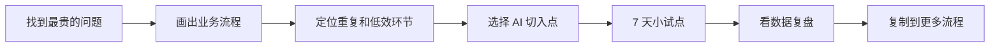
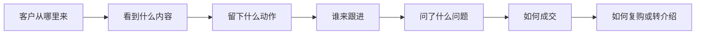

# 老板 AI 落地实战地图

适用对象：中小企业老板、创始人、业务负责人。

用途：帮助老板从“收藏 AI 工具”转向“用 AI 改造真实业务流程”。

## 一句话

老板做 AI，不是先学工具，而是先找到公司最贵的问题，再把流程拆清楚，最后选择 AI 去提效。

## 这份地图解决什么问题

很多公司做 AI 会卡在三个地方：

1. 工具很多，但没人知道用在哪个业务动作上。
2. 老板很兴奋，员工不知道怎么配合。
3. 学了提示词，但获客、销售、客服、运营没有明显变化。

这份地图的目标不是让你马上学会所有 AI 工具，而是帮你判断：

- 公司现在最该先改造哪件事。
- 这件事的流程卡在哪里。
- 哪一步最适合先用 AI。
- 7 天内如何做一个小试点。

## 第一步：找到公司最贵的问题

先不要问“哪个 AI 工具好用”，先问：

> 公司现在哪个问题最贵、最重复、最影响收入或成本？

| 问题类型 | 典型表现 | 可能损失 | AI 切入方向 |
| --- | --- | --- | --- |
| 获客成本高 | 内容发了很多，没有精准咨询 | 流量浪费、获客贵 | 选题生成、客户问题沉淀、内容复盘 |
| 销售跟进乱 | 客户问完就沉默，销售靠记忆跟进 | 线索流失、成交变慢 | 跟进提醒、异议话术、客户分层 |
| 客服重复回复 | 每天重复回答相似问题 | 人效低、服务不稳定 | FAQ 生成、标准回复、问题分类 |
| 内容生产慢 | 运营每天临时憋选题 | 发布不稳定、账号断更 | 选题库、脚本库、素材复用 |
| 管理反馈慢 | 老板不知道每天卡在哪里 | 决策滞后、执行黑箱 | 日报总结、数据看板、异常提醒 |

自测问题：

1. 这个问题每周重复出现几次？
2. 这个问题是否直接影响收入、成本或客户体验？
3. 如果这个问题改善 30%，公司会不会明显变好？

如果答案是“会”，它就是优先 AI 改造对象。

## 第二步：把流程画出来

AI 不能改造一团乱麻。你要先把业务流程画成一条线。

以“获客”为例：

流程画出来后，再找三类环节：

| 环节 | 判断标准 | 例子 |
| --- | --- | --- |
| 最重复 | 每天都做，动作类似 | 客服回复、客户问题整理 |
| 最慢 | 耗时长，等待多 | 写脚本、整理报价、复盘销售 |
| 最容易丢客户 | 影响成交或跟进 | 私信未回复、销售忘记追踪 |

## 第三步：选 AI 切入点

不要一开始就改核心业务。先选一个低风险、高重复、能看到结果的小环节。

| 优先级 | 适合先做 | 不适合先做 |
| --- | --- | --- |
| 高 | 选题生成、日报总结、客户问题整理、销售跟进提醒 | 直接替代销售成交 |
| 中 | 标准回复、脚本草稿、数据复盘、知识库整理 | 全公司流程一次性重做 |
| 低 | 复杂决策、财务审批、重大客户判断 | 没有人工复核的自动决策 |

选择标准：

1. 这个动作是否每周重复 5 次以上？
2. 是否有清晰输入和输出？
3. 结果是否能由人快速检查？
4. 7 天内能不能看到变化？

## 第四步：做 7 天小试点

不要一上来做“大项目”，先做一个 7 天试点。

| 天数 | 动作 | 交付物 |
| --- | --- | --- |
| 第 1 天 | 选一个最贵问题 | 问题定义表 |
| 第 2 天 | 画出当前流程 | 流程图 |
| 第 3 天 | 找出 1 个 AI 切入点 | 试点动作 |
| 第 4 天 | 设计 AI 输入输出 | 提示词或模板 |
| 第 5 天 | 让员工跑一遍 | 试运行记录 |
| 第 6 天 | 对比人工和 AI 辅助结果 | 效果对比 |
| 第 7 天 | 决定保留、调整或放弃 | 复盘结论 |

## 第五步：看数据，不看感觉

AI 落地是否有效，不能靠“感觉挺高级”，要看业务数据。

| 场景 | 核心指标 | 辅助指标 |
| --- | --- | --- |
| 内容获客 | 精准评论、私信、进群、咨询数 | 播放、点赞、收藏 |
| 销售跟进 | 跟进及时率、成交推进数 | 话术使用率、客户回复率 |
| 客服 | 回复时间、重复问题处理量 | 客户满意度、人工介入率 |
| 运营管理 | 日报完整率、异常发现速度 | 任务延期数、复盘质量 |

判断规则：

1. 只涨播放，不涨精准咨询，不算成功。
2. 员工更忙了，不算成功。
3. 流程更清楚、动作更稳定、客户问题有沉淀，才算开始有效。

## 老板自查表

请填 5 个问题：

| 问题 | 你的答案 |
| --- | --- |
| 公司现在最贵的问题是什么？ |  |
| 这个问题属于获客、销售、客服、内容、管理中的哪一类？ |  |
| 这个问题现在的流程有哪 5 个步骤？ |  |
| 哪一步最重复、最慢或最容易丢客户？ |  |
| 7 天内可以用 AI 先试哪一个小动作？ |  |

## 最小行动清单

今天就可以做：

1. 写下公司最贵的 3 个问题。
2. 选一个最重复、最影响收入的问题。
3. 把它画成 5-7 个流程步骤。
4. 圈出最慢或最容易丢客户的一步。
5. 只用 AI 改造这一步，不要同时改全公司。

## 最后提醒

AI 不是工具收藏夹，也不是一键暴富按钮。

AI 真正有价值的地方，是进入你的业务流程，让重复动作更快，让客户问题有沉淀，让老板更早看到执行中的异常。

先找问题，再拆流程，最后选工具。

这才是老板做 AI 的正确顺序。
