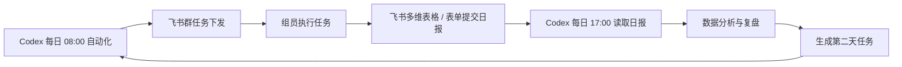

---
类型: 工具笔记
状态: 已沉淀
创建时间: 2026-07-03
来源: Codex 对话
tags:
  - 飞书
  - 自动化
  - 每日任务
  - AI一人公司
---

# 飞书任务下发与日报闭环

## 一句话结论

每日任务完全可以通过飞书下发给组员，组员在飞书提交完成情况，再由 Codex 读取日报数据、分析执行结果，并生成第二天任务。

## 推荐闭环



## 最小可行方案

第一版不要做复杂系统，先用三件东西跑通：

1. 飞书群：接收每日任务。
2. 飞书自定义机器人 Webhook：让 Codex 或本地脚本把 08:00 任务发到群里。
3. 飞书多维表格或表单：让组员 17:00 前提交日报。

## 每日流程

| 时间 | 动作 | 工具 |
| --- | --- | --- |
| 08:00 | Codex 生成今日作战任务 | Codex 自动化 |
| 08:01 | 任务推送到飞书群 | 飞书群机器人 Webhook |
| 白天 | 组员执行拍摄、脚本、剪辑、发布、评论承接 | 人工 + 智能体 |
| 17:00 | Codex 提醒提交日报 | 飞书群机器人 |
| 17:00-18:00 | 组员填写完成情况和视频数据 | 飞书多维表格 / 表单 |
| 晚上 | Codex 读取日报并生成复盘 | 飞书 API + Codex |
| 次日 08:00 | 基于复盘下发新任务 | Codex 自动化 |

## 角色提交字段

### N哥

| 字段 | 说明 |
| --- | --- |
| 今日是否完成出镜 | 是 / 否 |
| 实际录制条数 | 数字 |
| 最满意的 1 条 | 文本 |
| 没完成原因 | 文本 |
| 明天可拍摄时间 | 时间 |

### 编导 A

| 字段 | 说明 |
| --- | --- |
| 今日完成脚本数 | 数字 |
| 今日完成标题数 | 数字 |
| 今日完成钩子数 | 数字 |
| 明日建议选题 | 文本 |
| 需要N哥配合事项 | 文本 |

### 编导 B

| 字段 | 说明 |
| --- | --- |
| 今日剪辑条数 | 数字 |
| 今日发布条数 | 数字 |
| 发布账号 | 多选 |
| 评论“实战地图”数量 | 数字 |
| 私信数 | 数字 |
| 进群人数 | 数字 |
| 老板型评论 / 真实业务问题 | 文本 |
| 最好视频链接 | URL |
| 最差视频链接 | URL |

## 飞书接入方式

### 方案 A：群机器人 Webhook

适合第一版。

用途：

- 发送每日任务
- 发送 17 点日报提醒
- 发送复盘摘要

优点：

- 简单
- 不需要复杂前端
- 很适合团队群

限制：

- 主要用于发消息
- 不适合作为结构化数据源

### 方案 B：多维表格 API

适合日报和数据回收。

用途：

- 组员填写日报
- 每条视频填播放、评论、私信、进群
- Codex 读取表格记录并分析

优点：

- 结构化
- 可追踪历史
- 适合做数据复盘

限制：

- 需要配置应用权限和表格字段

### 方案 C：正式飞书应用机器人

适合后续增强版。

用途：

- 给指定人员或群发送消息
- 接收互动卡片
- 做审批和任务确认

优点：

- 权限更完整
- 可扩展为真正的内部工作流

限制：

- 配置更复杂
- 需要应用凭证、权限和回调配置

## 第一版建议

先做：

- 08:00 自动生成任务并发到飞书群
- 17:00 飞书群提醒提交日报
- 组员在飞书多维表格填写日报
- Codex 晚上读取表格并生成第二天任务

暂时不做：

- 飞书里复杂审批
- 自动私聊每个成员
- 自动判断绩效
- 自动处罚或强提醒

## 需要准备的信息

要真正接入，需要准备：

1. 飞书群机器人 Webhook 地址。
2. 飞书多维表格链接。
3. 多维表格 app_token 和 table_id。
4. 飞书应用的 app_id 和 app_secret。
5. 每个组员的姓名和职责。
6. 每天任务下发的群名称。
7. 日报字段最终版本。

## 安全规则

- Webhook、app_secret、token 不写入知识库和 GitHub。
- 密钥只放在本地 `.env` 或安全配置里。
- 群机器人第一版只允许发送任务和提醒，不允许做删除、修改、审批等高风险动作。
- Codex 分析日报时，只读取项目相关数据，不读取无关聊天记录。

## 当前自动化挂载点

当前 Codex 已有自动化：

```text
id: ai-ip-08
name: AI商业IP增长项目 - 每日08点任务与17点日报
时间: 每天北京时间 08:00 和 17:00
```

飞书集成应挂在这个自动化之后：

- 08:00：生成任务后调用飞书机器人推送。
- 17:00：推送日报提醒和表格链接。
- 晚上：读取表格后生成复盘与次日任务。

